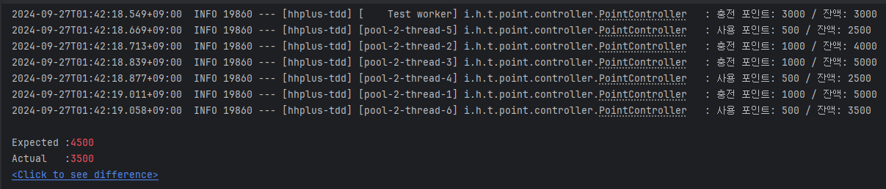
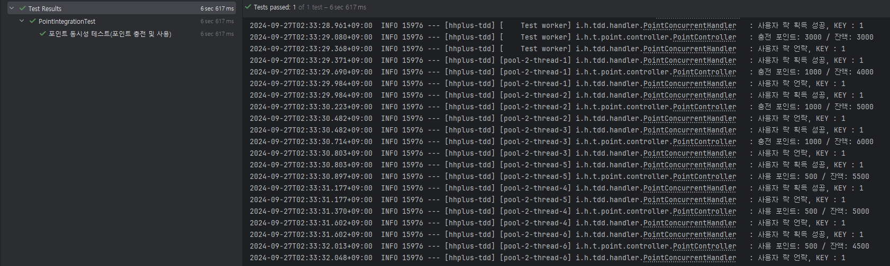

# 항해 플러스 1주차. TDD로 개발하기

## 요구사항

> `Default`
> - `/point` 패키지(디렉토리) 내에 `pointService` 기본 기능 작성
> - `/database` 패키지의 구현체는 수정하지 않고, 이를 활용해 기능을 구현
> - 각 기능에 대한 단위 테스트 작성
>  총 4가지 기본 기능 (포인트 조회, 포인트 충전/사용 내역 조회, 충전, 사용)을 구현합니다.
 
> `Step 1`
> - 포인트 충전, 사용에 대한 정책 추가 (잔고 부족, 최대 잔고 등)
> - 동시에 여러 요청이 들어오더라도 순서대로 (혹은 한번에 하나의 요청씩만) 제어될 수 있도록 리팩토링
> - 동시성 제어에 대한 통합 테스트 작성

> `Step 2`
> 동시성 제어 방식에 대한 분석 및 보고서 작성 ( README.md )

## 동시성 제어가 필요한 상황

동시성 제어가 필요한 매서드는 포인트를 충전하는 `Charge`와 포인트를 사용하는 `Use`가 있다.

`Charge` 매서드와 `Use` 매서드는 아래와 같이 동작한다.
1. 특정 유저의 포인트를 조회한다.
2. 충전/사용 포인트를 기존 포인트에 가산/차감하여 포인트를 업데이트한다.
3. 포인트를 충전/사용 내역을 저장한다.

동시에 포인트 충전 및 사용에 대한 요청이 들어올 경우를 가정하여 아래와 같은 테스트 코드를 작성하였다.

```java
    @Test
    @DisplayName("포인트 동시성 테스트(포인트 충전 및 사용)")
    void pointConcurrentTest() throws InterruptedException {
        // given
        pointService.charge(1L, 3000L);
    
        // when
        ExecutorService executorService = Executors.newFixedThreadPool(6);
    
        executorService.submit(() -> pointService.charge(1L, 1000L));
        executorService.submit(() -> pointService.charge(1L, 1000L));
        executorService.submit(() -> pointService.charge(1L, 1000L));
        executorService.submit(() -> pointService.use(1L, 500L));
        executorService.submit(() -> pointService.use(1L, 500L));
        executorService.submit(() -> pointService.use(1L, 500L));
    
        if (!executorService.awaitTermination(Constants.LOCK_TIMEOUT, TimeUnit.MILLISECONDS)) {
            executorService.shutdownNow();
        }
    
        // then
        UserPoint userPoint = pointService.point(1L);
        assertEquals(6000L, userPoint.point());
    }
```
> `given` 특정 유저의 포인트를 3000 만큼 충전한다.
> 
> `when` 동시에 1000 만큼 충전 3회, 500 만큼 사용 요청 3회 요청한다.
> 
> `then` 최종 포인트 기댓값은 4500 이어야 한다.

동시성 제어 없이 위의 테스트를 실행하면, 아래와 같은 결과가 발생한다.



멀티 쓰레드 환경에서 요청에 대한 공유 자원인 `UserPointTable`의 `UserPoint`의 원자성이 보장되지 않았기 때문이다.

이와 같은 문제를 해결하기 위해서는 동시에 하나의 스레드에서만 코드를 실행하거나 공유자원의 값을 변경하는 작업을 수행해야 한다.(Mutual-Exclusion 상호배제)

## 해결 방법

> `제약 조건`
> 이번 과제에서는 아래과 같은 제약 조건을 제시한다.
> 1. 분산 환경을 고려하지 않는다.
> 2. `/database` 패키지의 구현체는 수정하지 않는다.

동시성 제어를 하는 방법은 다양하지만, 이번 과제에 제시된 제약 조건을 고려한 취사 선택이 필요하다.

### java.util.concurrent

`java.util.concurrent`에서 제공하는 동시성 제어 방식은 CAS 알고리즘을 활용한 방법이다.
락을 걸지 않아도 된다는 장점이 있지만, 이번 과제의 제약 조건 중 `2. /database 패키지 구현체는 수정하지 않는다.`는 제약 조건에 위배되어 배제하였다.

### LOCK
`LOCK`을 활용한 동시성 제어 방식은 직관적이지만, `Lock 경쟁`이나 `Dead Lock` 밟생할 수 있다는 단점이 있다.
본인은 이번 과제의 내용을 DB가 아닌 Java 수준에서 비관적 락을 구현하는 것으로 해석하여, `LOCK`을 활용한 동시성 제어를 아래와 같이 구현하였다.

```java
    
    // 공유 자원은 특정 유저의 포인트이므로, 유저 별 Lock을 생성하였다.
    // ConcurrentHashMap을 통해 Lock에 대한 자원에 대한 가시성을 확보하였다.
    // 이 때문에 암묵적 Lock(synchronized)이 아닌 명시적 Lock을 활용하였다. 
    private final ConcurrentHashMap<Long, Lock> userLockMap = new ConcurrentHashMap<>();

    /**
     * 포인트 충전 및 사용에 동시성 처리를 한다.
     *
     * @param id 유저 ID
     * @param function 포인트 충전 및 사용
     * @return
     */
    // 명시적 Lock의 문제점 중 하나인 Dead Lock 현상을 방지하기 위해, 자바의 함수형 프로그래밍을 활요하여 서비스 로직을 감쌌다.
    public UserPoint executeConcurrentUserPoint(long id, Supplier<UserPoint> function) {

        Lock lock = userLockMap.computeIfAbsent(id, key -> new ReentrantLock());

        boolean acquired = false;

        try {
            // Lock에 대한 효율성을 높이기 위해, tryLock 메서드를 활용하였다.
            // Timeout 시간은 5초로 설정하였다.
            acquired = lock.tryLock(Constants.LOCK_TIMEOUT, TimeUnit.MILLISECONDS);
            if(!acquired) {
                log.info("사용자 락 획득 타임아웃");
                throw new IllegalArgumentException("사용자 락 획득 타임아웃");
            }

            log.info("사용자 락 획득 성공, KEY : {}", id);

            return function.get();

        } catch (InterruptedException e) {
            throw new IllegalArgumentException("사용자 락 획득 오류");
        } finally {
            // Lock을 취득한 경우, 작업이 마무리 되면 안전하게 Lock을 해제한다.
            if(acquired) {
                lock.unlock();
                log.info("사용자 락 언락, KEY : {}", id);
            }
        }
    }
```

위에서 구현한 동시성 제어를 적용한 서비스 로직은 아래와 같다.

`기존`
```java
/**
 * 특정 유저의 포인트를 사용한다.
 *
 * @param id 유저 ID
 * @param amount 사용할 포인트
 * @return 사용 후 포인트
 */
@Override
public UserPoint use(long id, long amount) {

    if (amount <= 0) {
        throw new IllegalArgumentException("사용할 포인트는 0보다 커야 합니다.");
    }

    UserPoint currentPoint = userPointRepository.selectById(id);

    if (currentPoint.point() - amount < 0) {
        throw new IllegalStateException("사용 후 포인트가 0보다 작습니다.");
    }

    UserPoint userPoint = userPointRepository.insertOrUpdate(id, currentPoint.point() - amount);

    log.info("사용 포인트: {} / 잔액: {}", amount, userPoint.point());

    pointHistoryRepository.insert(id, amount, TransactionType.USE, System.currentTimeMillis());

    return userPoint;
}

```
`변경 후`
```java
    /**
 * 특정 유저의 포인트를 사용한다.
 *
 * @param id 유저 ID
 * @param amount 사용할 포인트
 * @return 사용 후 포인트
 */
@Override
public UserPoint use(long id, long amount) {
    return pointConcurrentHandler.executeConcurrentUserPoint(id, () -> {
        if (amount <= 0) {
            throw new IllegalArgumentException("사용할 포인트는 0보다 커야 합니다.");
        }

        UserPoint currentPoint = userPointRepository.selectById(id);

        if (currentPoint.point() - amount < 0) {
            throw new IllegalStateException("사용 후 포인트가 0보다 작습니다.");
        }

        UserPoint userPoint = userPointRepository.insertOrUpdate(id, currentPoint.point() - amount);

        log.info("사용 포인트: {} / 잔액: {}", amount, userPoint.point());

        pointHistoryRepository.insert(id, amount, TransactionType.USE, System.currentTimeMillis());

        return userPoint;
    });
}
```
동시성 제어 후 테스트 결과를 살펴보자.

테스트에 성공한 것을 확인할 수 있다!

## 보완하고 싶은 점
`Lock`을 사용을 하면서 처리시간에 지연이 발생할 수 있음을 인지하였다.

이에 다음과 같은 생각을 해보았다.

현재 구현된 서비스에서 공유 자원 `UserPoint`와 직접적인 트랜젝션을 수행하는 것은 `insertOrUpdate`이다.
그러므로, 해당 부분까지 Lock 블록을 설정하고, 히스토리를 저장하는 `insert`를 `queue`와 같은 자료구조에 할당하여 비동기로 처리하면 어떨까?

`concurrentHashMap`을 통해 관리하는 부분에서 유저가 많아질 경우, 메모리 문제가 발생할 수 있다. 어떻게 처리하면 좋을까?

## 느낀점
이번 과제를 통해 자바를 어떻게 공부해야 하는지 살짝 맛을 볼 수 있었던 것 같다.
각 클래스들이 어떻게 동작하고 어떤 알고리즘으로 작동하는지 보기에 매우 어려웠지만, 조금만 더 익숙해지면 굉장히 흥미로울 것 같다.


